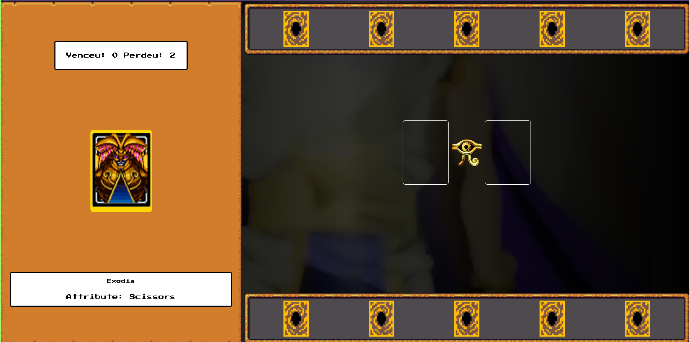

<h1 align="center">Yu-Gi-Oh | Jo-ken-po Edition</h1>

  
  

  

## 🎮 Projeto

- Criando um Jogo de Cartas do Yu-Gi-Oh! com JavaScript e CSS
- Jogo de jokenpo que visando entender melhor conceitos de lógica de programação aplicados a jogos

<a href="https://leoviana00.github.io/yu-gi-oh-game-jokenpo/">Play Game</a>

## 👨‍💻 Abordagens

- Armazenamento e gerenciamento de estado manual
- Funções limpas
- Organização de código
- Técnica de Extract to Method
- States da engine
- Enum dos cards
- Assinatura de funções
- Lógica para:
    - distribuição e colocar as cartas em campor
    - remoção de cartas do campo
    - checar duelos
    - aumentar score
    - reset de duelo
    - outros
- Efeitos sonoros

